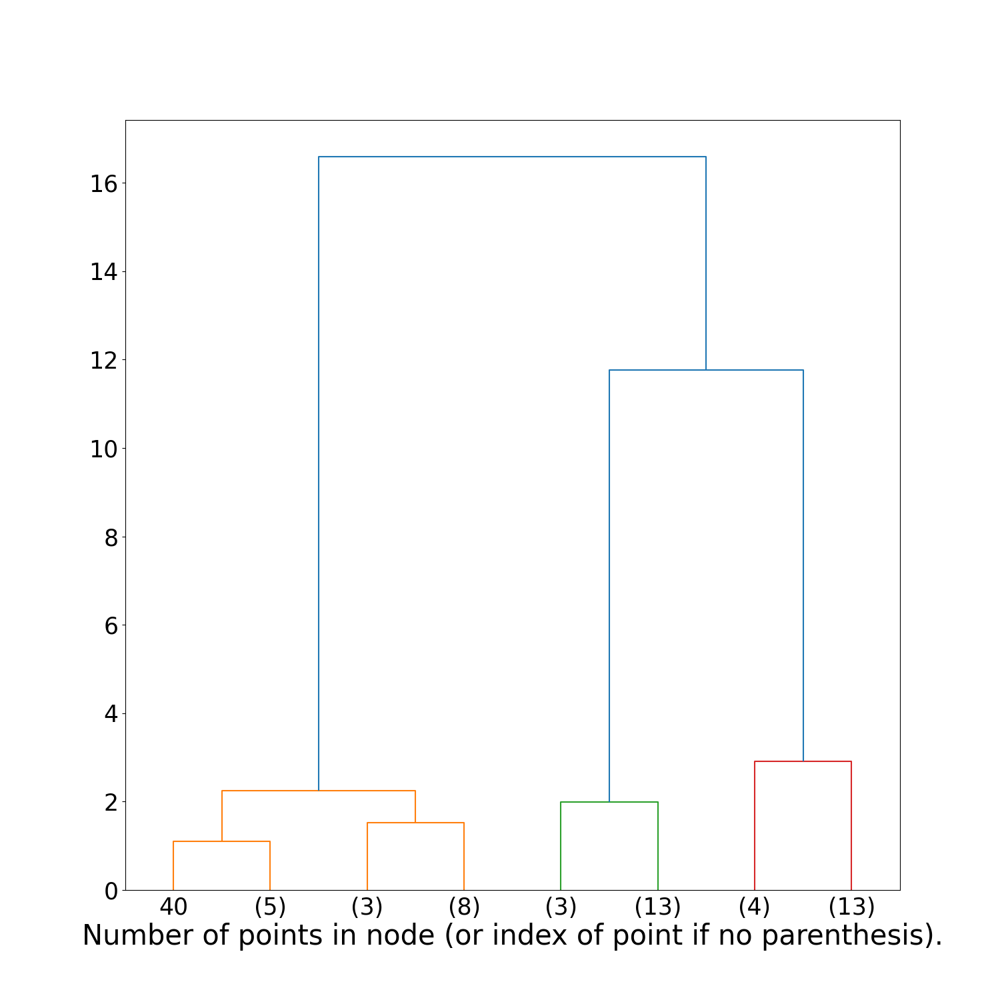
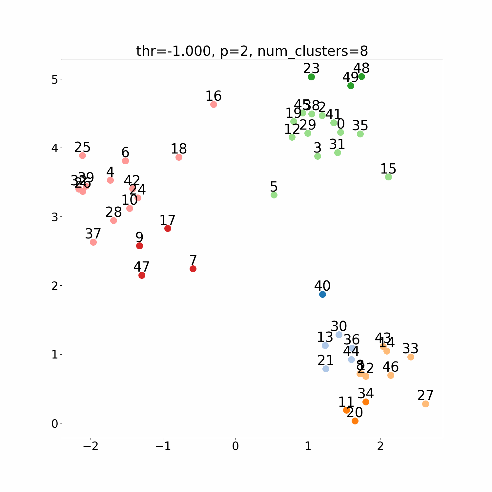

# dendro-thresh-cluster

<!---
sklearn の AgglomerativeClustering から生成した　dendrogram　では, threshold ごとに各 node が属する clustering が分かりにくい. dendro-thresh-cluster は threshold ごとに各 node が属する clustering を図示するプログラムである. 上の図から, threshold が増えるにつれ, cluster 数が少なくなり, それぞれの cluster に属する node の数が増えるのが分かる.
--->

In the dendrogram generated from `sklearn.cluster.AgglomerativeClustering`, it is difficult to understand the clustering to which each node belongs for each threshold. `dendro-thresh-cluster` is a program that shows the clustering to which each node belongs for each threshold. From the above figure, you can see that the number of clusters decreases as the threshold increases, and the number of nodes belonging to each cluster increases.

Translated with www.DeepL.com/Translator (free version)

# reference
- [sklearn.cluster.AgglomerativeClustering](https://scikit-learn.org/stable/modules/generated/sklearn.cluster.AgglomerativeClustering.html)
- [scipy.cluster.hierarchy.dendrogram](https://docs.scipy.org/doc/scipy/reference/generated/scipy.cluster.hierarchy.dendrogram.html#scipy.cluster.hierarchy.dendrogram)

# contribution
Everyone is welcome to contribute. 